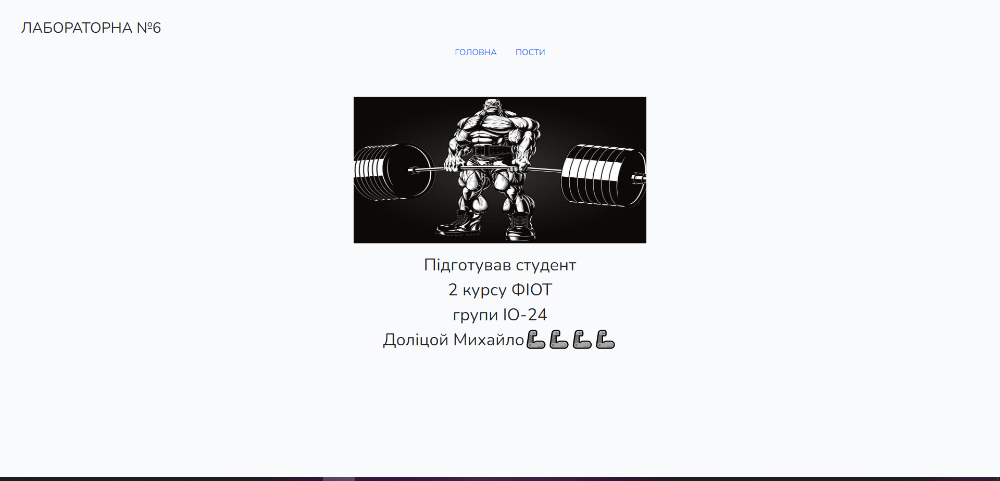
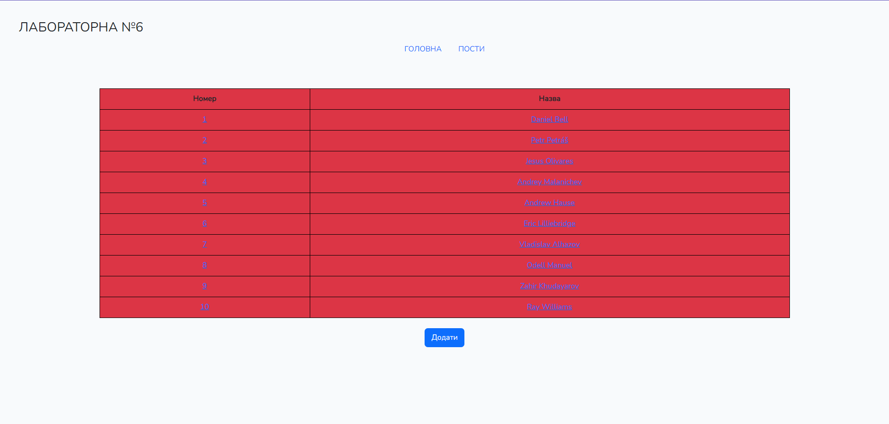
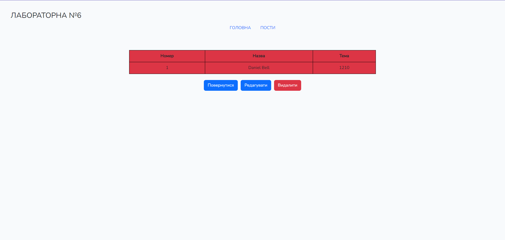
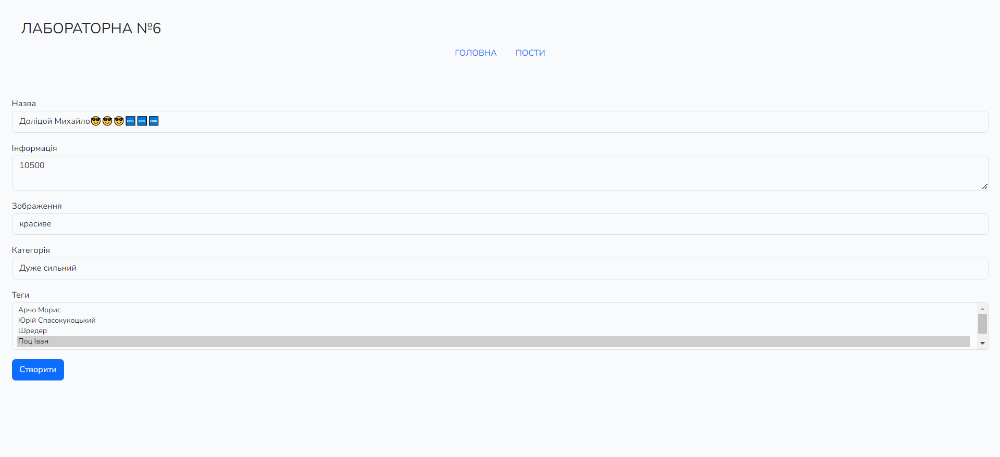
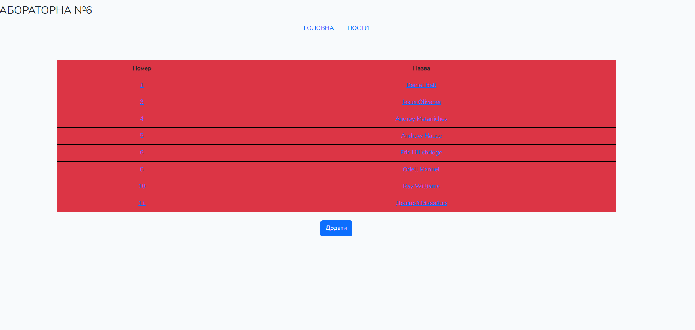
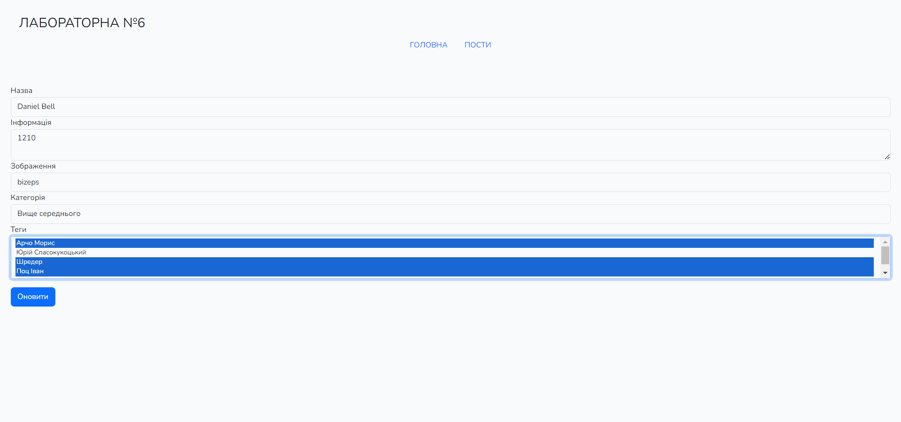
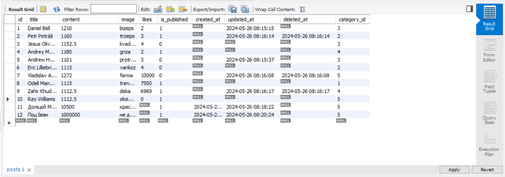
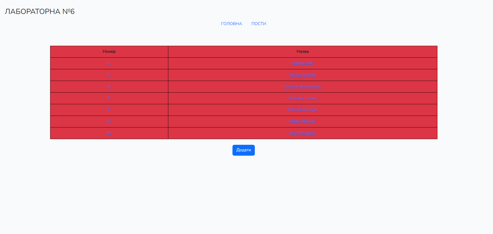

# Тестування працездатності системи

# Тестування працездатності системи ІО-24 Севастьянов Максим

## CRUD
[CRUD](https://highload.today/uk/shho-take-crud-prostimi-slovami-funktsiyi-perevagi-ta-prikladi/) — це скорочення від англійських слів, що позначають чотири операції:
    
Main(головне меню)
Create (створювати);
Update (оновлювати);
Read (читати);
Delete (видаляти).
### Main

### Create

### Update

### Read

### Delete

